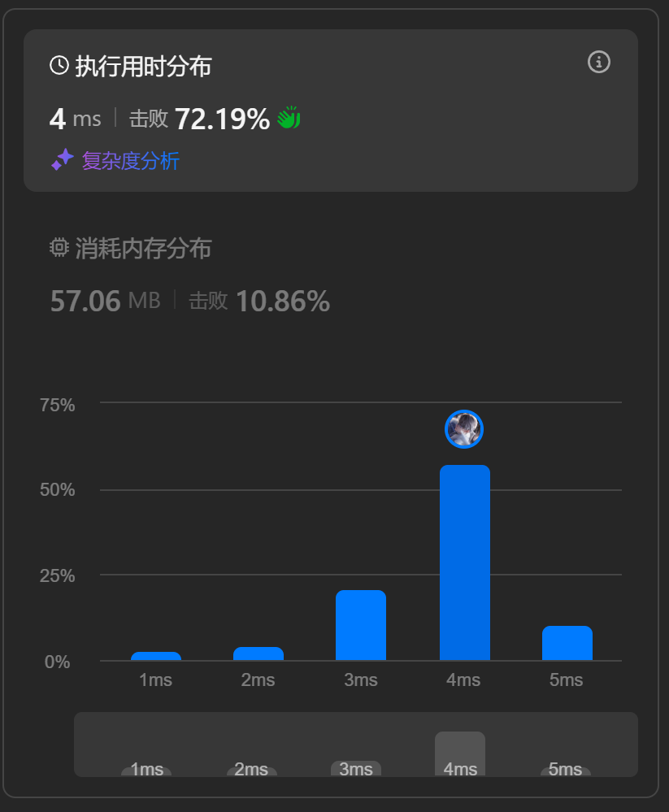

# 11、盛水最多的容器

双循环：应该会超时，基本的计算思路是两个高度取最小者然后计算两个高度的x轴差并将这两个值相乘

更好的思想是双指针

虽然java中并没有指针的定义，但其实思想是不变的

以i为左指针，j为右指针，思想就是将两个指针向中间移动，哪个小就移动哪一个

代码：

```java
class Solution {
    public int maxArea(int[] height) {
        int i = 0;
        int j = height.length - 1;
        int max = 0;
        while (i < j) {
            max = Math.max(max, Math.min(height[i], height[j]) * (j - i));
            if(height[i] < height[j]) {
                i++;
            }
            else{
                j--;
            }
        }
        return max;
    }
}
```

<figure><figcaption></figcaption></figure>
